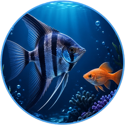
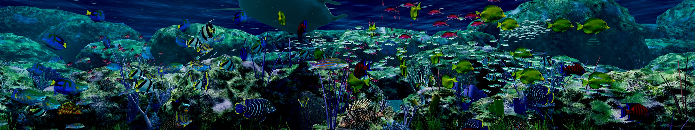

# Ultra Aquarium

One aquarium across all your screens. Ultra Aquarium is a free 3D aquarium for Windows that runs as your screensaver or as live wallpaper, and treats two, three or four monitors as a single tank.



## Download

**[UltraAquarium-7.0.3.msi](download/UltraAquarium-7.0.3.msi)** (12.6 MB, Windows 10 or 11, 64-bit)

The same file is at [aquarium.technology83.com](https://aquarium.technology83.com). Run it and the app opens when it finishes. If Windows asks for the .NET 8 Desktop Runtime, say yes: it is a free Microsoft component that many apps share.

To check your download, compare its SHA-256 with the one in [RELEASES.md](RELEASES.md):

```powershell
Get-FileHash .\UltraAquarium-7.0.3.msi -Algorithm SHA256
```

## What it does

- **Pick your screens.** Choose which monitors show the aquarium. The others keep your desktop, or go black while the screensaver runs.
- **Mixed setups are fine.** Different sizes, resolutions and refresh rates work together. Enter your bezel width and the picture lines up across the gap.
- **Feed the fish.** Press F and a pinch of food drops in from the surface. The nearest fish come over to eat.
- **Runs on a laptop.** The lowest quality setting is built for integrated graphics. Turn it up when you have the hardware.
- **Your own touches.** Design your own fish, add a clock, or have a school of fish swim through your own words.

## What is in this repository

Ultra Aquarium is not open source. The rendering engine, the fish and coral artwork and the models belong to Technology 83 Systems Ltd. and are not published here.

What is published is every part of the app that touches your computer or the internet outside of drawing the aquarium, so you can read exactly what it does:

| File | What it does |
|---|---|
| `app/Online.cs` | Everything the app does online: the check-in with aquarium.technology83.com, what is sent with usage sharing on and off, and the self-update (download, SHA-256 check, running the installer). |
| `app/Installer.cs` | How the screensaver is switched on and off (the registry values it sets). |
| `app/Autostart.cs` | The one registry value used to start the live wallpaper with Windows. |
| `app/ReefSettings.cs` | Every setting the app stores, and where. |
| `app/Program.cs` | The entry point and every command-line switch. |
| `installer-build.py` | How the installer package is put together: where files go, the Start menu shortcut, and what happens on upgrade. |
| `web/` | The complete service behind aquarium.technology83.com: the download page, the check-in endpoint, what is written to the database, and the developer area. |

These files are copied from the source the released builds are made from. They do not build on their own, because the rest of the app is not here.

What the app sends is described in [PRIVACY.md](PRIVACY.md). The licence is in [LICENSE.md](LICENSE.md): you may read these files and quote them when discussing the app; everything else is reserved.
